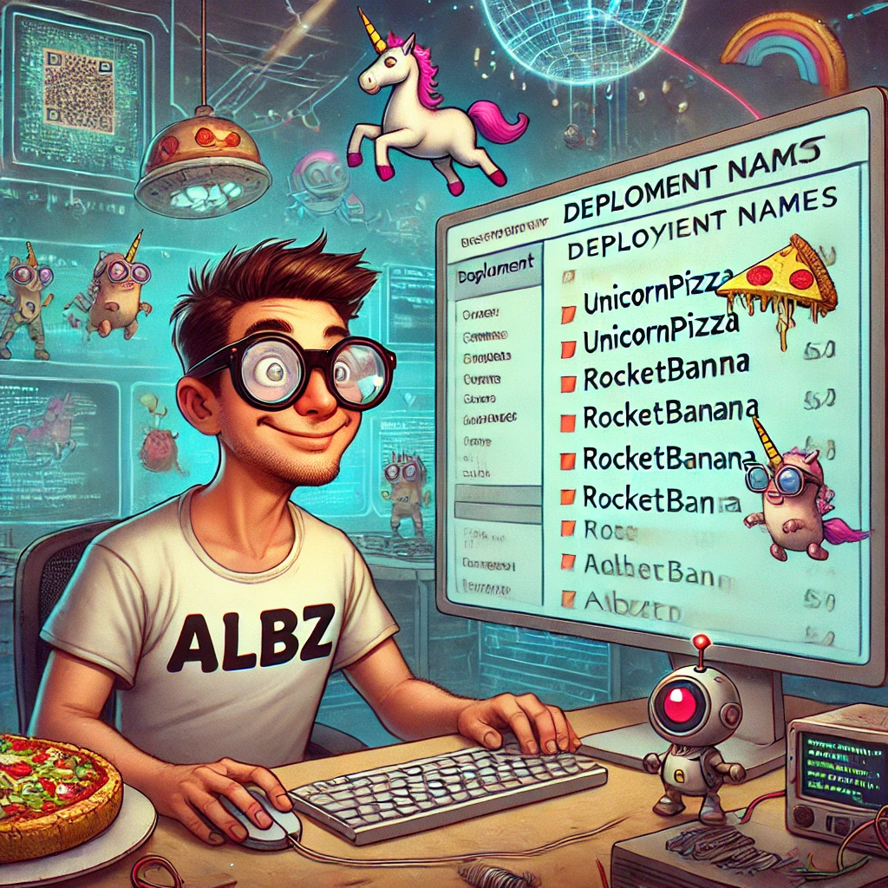

# Smart Contract Service

Dive deep into the blockchain world with our advanced suite of smart contracts. Whether you're deploying 'UnicornPizza'
or 'RocketBanana,' our platform ensures a straightforward and efficient process to bring your unique ideas to life.
Explore, create, and utilize the vast potential of blockchain technology with ease and precision.



## Installation Steps

Add your mnemonic and infura url in `.env` file, just rename the file `.env_sample` and fill it.

Example:

- `MNEMONIC="bla bla bla... "`
- `INFURA_URL=https://sepolia.infura.io/v3/<YOUR_INFURA_KEY>`

Install the dependencies

``` bash 
npm install
```
Compile smart-contract locally inside `builds` folder

```bash
npm run compile
```

Run test with _Mocha_
```bash 
npm run test
```

Deploy on infura or on the provider you prefer
``` bash
npm run deploy
```

_Contracts present in the folder `contracts`:_

- **AuthContract**: register user, authenticate, getPublicKey
- **LotteryContract**: register user, buy lottery ticket, claim lottery ticket
- **Campaign**: for every kind of campaign like kickstarter, this contract includes a **Factory functions**


## INFO

The smart contracts are deployed to the [Infura](https://app.infura.io/) testnet. But you can also
use [Remix](https://remix.ethereum.org/).

#### Prerequisites

You need to install **MetaMask** and connect it to the testnet for deploying the contracts.

## Instruction

In this repo, inside folder `contracts` there are:

- Authentication.sol
- Lottery.sol
- Campaign.sol 
  - CampaignFactory.sol

You can use it for testing the service.

What appears on consolle after lunch command `npm run deploy`:
```text
Enter the contract name (**without .sol extension**): <CONTRACT_NAME>
```

The result on the terminal will be like this:

``` text 
Attempting to auth from account 0xA9D3cxxxxxxx14C5Ac96f211F2
Deploying contract...
abi [
  { inputs: [], stateMutability: 'nonpayable', type: 'constructor' },
  {
    anonymous: false,
    inputs: [ [Object], [Object] ],
    name: 'ManagerSet',
    type: 'event'
  },
  {
    inputs: [],
    name: 'enter',
    outputs: [],
    stateMutability: 'payable',
    type: 'function'
  },
  {
    inputs: [],
    name: 'getPlayers',
    outputs: [ [Object] ],
    stateMutability: 'view',
    type: 'function'
  },
  {
    inputs: [],
    name: 'manager',
    outputs: [ [Object] ],
    stateMutability: 'view',
    type: 'function'
  },
  {
    inputs: [],
    name: 'pickWinner',
    outputs: [],
    stateMutability: 'nonpayable',
    type: 'function'
  },
  {
    inputs: [ [Object] ],
    name: 'players',
    outputs: [ [Object] ],
    stateMutability: 'view',
    type: 'function'
  }
]
Deployment successful. Contract address: 0x8Bxxxxxxxx71859dCE01

```

## Gift me a ⭐️

if you like this project, please give me a star.